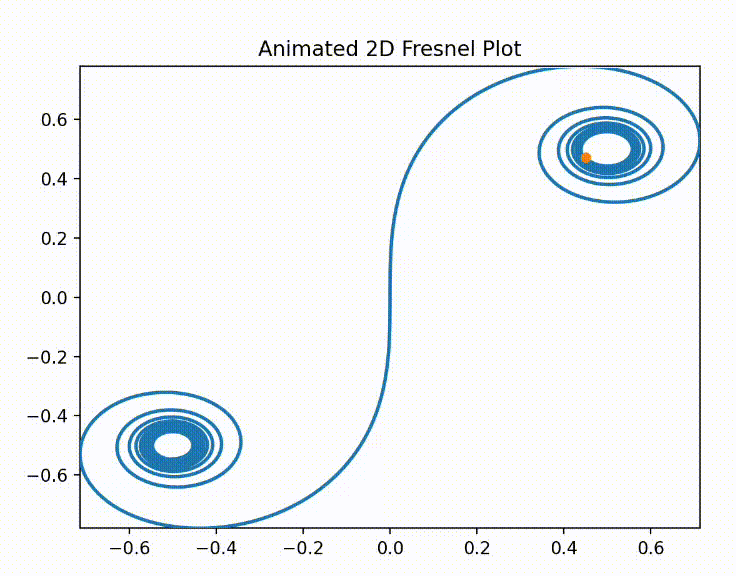

# animplotlib

This package acts as a thin wrapper around the
`matplotlib.animation.FuncAnimation` class to simplify animating `matplotlib`
plots.


## Features

- Simple animated 2D plots (AnimPlot)
- Animated 3D plots (AnimPlot3D)
- Supports multiple subplots/projections
- Supports regular matplotlib functionality

## Installation

```
pip install animplotlib
```

## Quickstart

### Basic 2D animation example

```python
# 2D animated plot of the fresnel integral
import numpy as np
import matplotlib.pyplot as plt
import scipy.special as sc
import animplotlib as anim

x = np.linspace(-7, 7, 5000)
y, z = sc.fresnel(x)

fig, ax = plt.subplots()
line, = ax.plot([], [], lw=2)
point, = ax.plot([], [], 'o')

ax.set_xlim(np.min(y), np.max(y))
ax.set_ylim(np.min(z), np.max(z))
ax.set_title("Animated 2D Fresnel Plot")

anim.AnimPlot(fig, line, point, y, z, plot_speed=2, l_num=len(x))
```



### Basic 3D animation example

```python
# 3D animated plot of a trefoil knot
import numpy as np
import matplotlib.pyplot as plt
import animplotlib as anim

n = 1000
phi = np.linspace(0, 2 * np.pi, n)
x = np.sin(phi) + 2 * np.sin(2 * phi)
y = np.cos(phi) - 2 * np.cos(2 * phi)
z = -np.sin(3 * phi)

fig = plt.figure()
ax = fig.add_subplot(111, projection='3d')

# linewidth set to 0 to hide the line being animated
lines, = ax.plot([], [], [], lw=0)
points, = ax.plot([], [], [], 'o', markersize=10, markerfacecolor='None',)

# static plit of the full trefoil knot in the background
ax.plot(x, y, z, c='lightblue')

ax.set_xlim(np.min(x), np.max(x))
ax.set_ylim(np.min(y), np.max(y))
ax.set_zlim(np.min(z), np.max(z))
ax.set_axis_off()

anim.AnimPlot3D(fig, ax, lines, points, x, y, z, plot_speed=1, rotation_speed=0.36, p_num=1)
```


## Documentation

- [API Reference](https://github.com/aymenhafeez/animplotlib/blob/master/docs/API.md)
- [Examples](https://github.com/aymenhafeez/animplotlib/tree/master/examples)

## License

MIT

## Author

Aymen Hafeez  
[Website](https://aymenhafeez.github.io) |
[GitHub](https://github.com/aymenhafeez)
