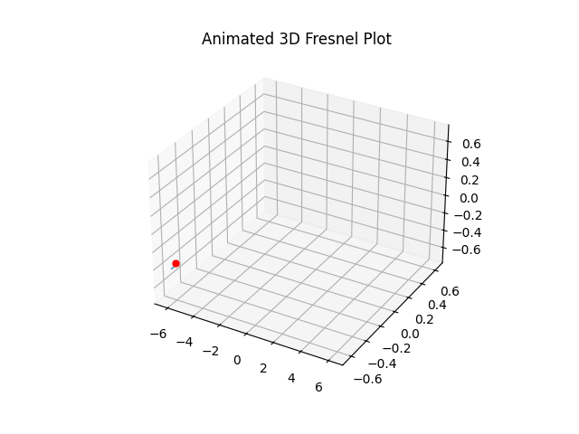

# animplotlib

This package acts as a thin wrapper around the
`matplotlib.animation.FuncAnimation` class to simplify animating `matplotlib`
plots.

<center>
  <figure> 
     
  </figure>
</center>

## Installation

```
pip install animplotlib
```

## Quickstart

### Basic 2D animation example

```python
# 2D animated plot of the fresnel integral
import numpy as np
import matplotlib.pyplot as plt
import scipy.special as sc
import animplotlib as anim

x = np.linspace(-7, 7, 5000)
y, z = sc.fresnel(x)

fig, ax = plt.subplots()
line, = ax.plot([], [], lw=2)
point, = ax.plot([], [], 'o')

ax.set_xlim(np.min(y), np.max(y))
ax.set_ylim(np.min(z), np.max(z))
ax.set_title("Animated 2D Fresnel Plot")

anim.AnimPlot(fig, line, point, y, z, plot_speed=2, l_num=len(x))
```

<center>
  <figure> 
     
  </figure>
</center>

<!--  -->

### Basic 3D animation example

```python
# 3D animated plot of the fresnel integral
import numpy as np
import matplotlib.pyplot as plt
import scipy.special as sc
import animplotlib as anim

# generate fresnel data
x = np.linspace(-7, 7, 1000)
y, z = sc.fresnel(x)

# create figure and axes - projection='3d' for 3D plot
fig = plt.figure()
ax = fig.add_subplot(111, projection='3d')
# line and point to add the data to - three empty lists for 3D data
line, = ax.plot([], [], [], lw=1)
point, = ax.plot([], [], [], 'ro', markersize=5)

ax.set_xlim(np.min(x), np.max(x))
ax.set_ylim(np.min(y), np.max(y))
ax.set_zlim(np.min(z), np.max(z))
ax.set_title("Animated 3D Fresnel Plot")

anim.AnimPlot3D(fig, ax, line, point, x, y, z, plot_speed=5)
```



## Documentation

- [API Reference](https://github.com/aymenhafeez/animplotlib/blob/master/docs/API.md)
- [Advanced examples](https://aymenhafeez.github.io/animplotlib/)

## License

MIT

## Author

Aymen Hafeez  
[Website](https://aymenhafeez.github.io) |
[GitHub](https://github.com/aymenhafeez)
